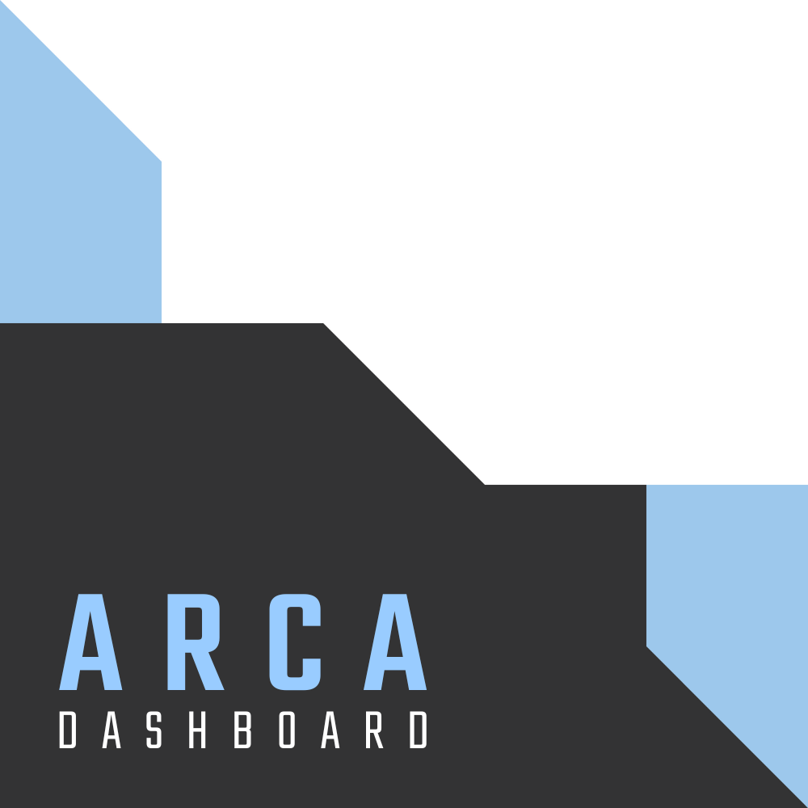

<p align="center">
  
</p>


### Summary

- [About](#about)
- [Getting Started](#getting-started)
- [Building the app](#building-the-app)
- [Connecting to the Liquid Galaxy](#connecting-to-the-liquid-galaxy)
- [Setting up the rig](#setting-up-the-rig)
- [License](#license)
- [Privacy Policy and Terms & Conditions](#privacy-policy-and-terms--conditions)

### About

The project aims to have a better control of the lands and show the collected information of the robots.

With the data available into the app, is possible to send it to the Liquid Galaxy system to be shown into Google Earth.

Have a look at the application into.

### Getting started

Before continuing, make sure to have installed in your machine [Git](https://git-scm.com/) and [Flutter](https://flutter.dev). Read [Flutter documentation](https://docs.flutter.dev) for further information.

Then, clone the project:

```bash
$ git clone https://github.com/Arturito01/AgroRobotSwarm-dashboard.git
$ cd arca
```

With the project cloned, run it by using the following command:

> ❗ You must have a mobile device connected or an android emulator running in order to run the app.

```bash
$ flutter run 
```

### Building the apk

```bash
$ flutter build apk --no-tree-shake-icons
```

Once done, the APK file may be found into the `/build/app/outputs/flutter-apk/` directory, named `app-release.apk`.

### Building the app bundle

```bash
$ flutter build appbundle --no-tree-shake-icons
```

Once done, the AppBundle file may be found into the `/build/app/outputs/bundle/release` directory, named `app-release.abb`.

### Connecting to the Liquid Galaxy

With the app opened, a cog button (⚙️) may be seen into the home page toolbar (top right corner). When clicked, it will lead you to the settings page, in which a form may be found.

Fill it up with the Liquid Galaxy host name, password, IP address and SSH connection port (change it only if the system `22` default SSH port was changed).

After done, click into the `Connect` button and check whether there's a `Connected` green label on the LiquidGalaxy button, in case it doesn't, there's something wrong with the given information or your device connection.

Once connected, head back to the home page and use the app as you wish. Note that all of the data is kept into the local storage after the first load. 

### Setting up the rig

An important step to take is configure the slave screens for refreshing when setting solo KMLs.

To set it up, head to the settings page by hitting the cog button (⚙️) and go to the Liquid Galaxy tab.

In the button list, you shall see a button `SET SLAVES REFRESH` and `RESET SLAVES REFRESH`. The first one will setup your slave screens to refresh its solo KML every 2 seconds. The second one will make your slaves stop refreshing.

> ❗ _Both actions will **reboot** your Liquid Galaxy, so the changes may be applied._
